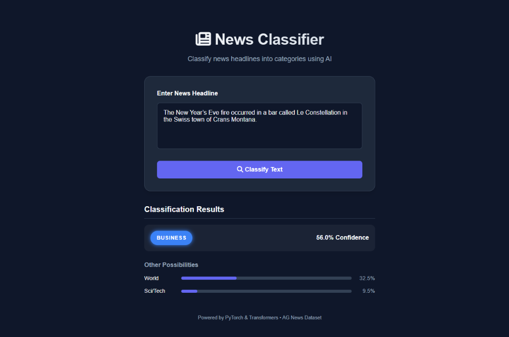

# News Classifier App

A machine learning application that classifies news headlines into four categories:
- World
- Sports
- Business
- Sci/Tech

Powered by **Flask**, **PyTorch**, and **Transformers** (BERT).



## Project Structure

- `app.py`: Flask application server.
- `train.py`: Script to train the model on the AG News dataset.
- `model_utils.py`: Model definition (`TransformerBiLSTM`) and utilities.
- `templates/`: HTML templates.
- `static/`: CSS styles.
- `checkpoints/`: Directory to store trained models.

## Setup

1. **Install Dependencies**
   ```bash
   pip install -r requirements.txt
   ```

2. **Train the Model**
   Before running the app, you need a trained model.
   ```bash
   python train.py
   ```
   *Note: This script uses `distilbert-base-uncased` and subsamples the dataset (20%) for faster training on CPU.*

3. **Run the App**
   ```bash
   python app.py
   ```
   Open [http://127.0.0.1:5000](http://127.0.0.1:5000) in your browser.

## Model Details
The model uses `bert-base-uncased` as a feature extractor, feeding into a Bidirectional LSTM, followed by a linear classifier.
